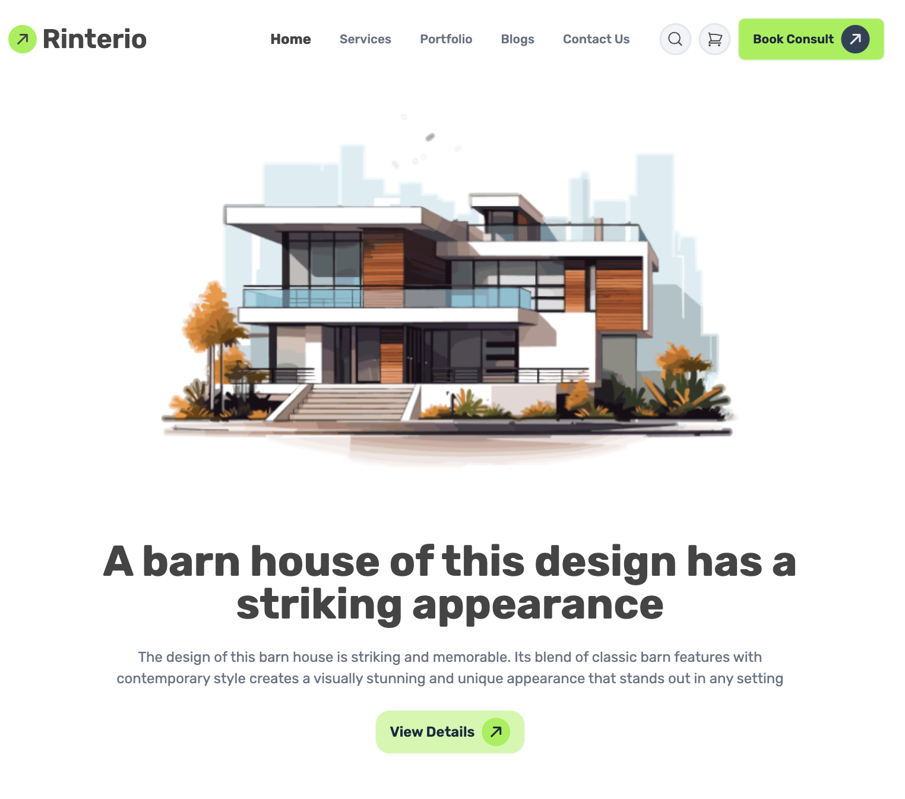
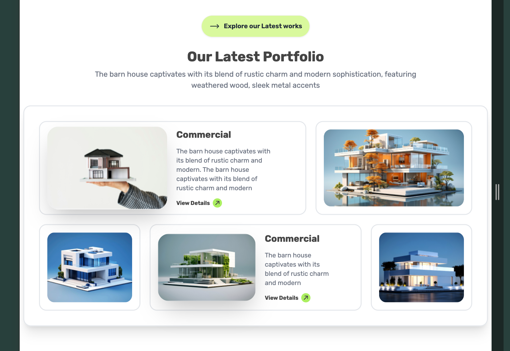
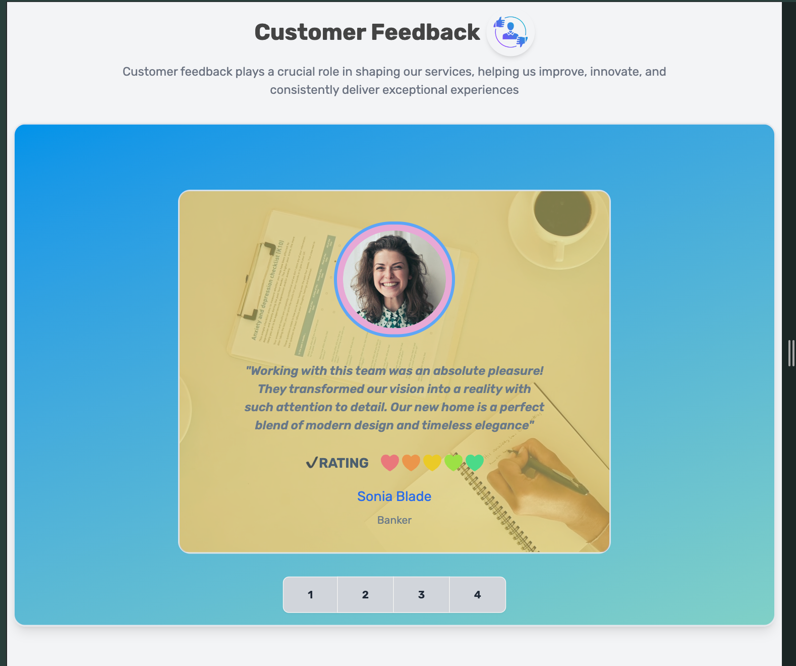
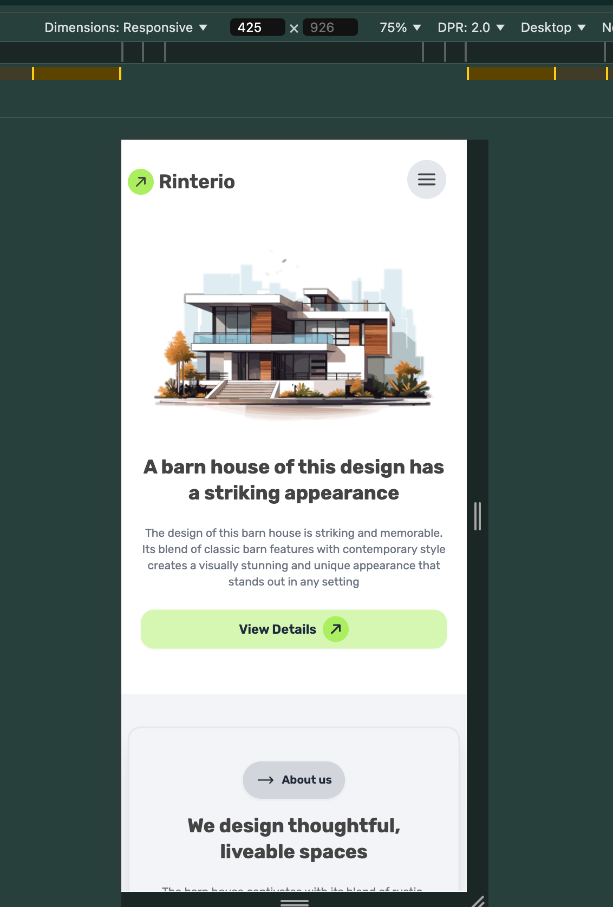
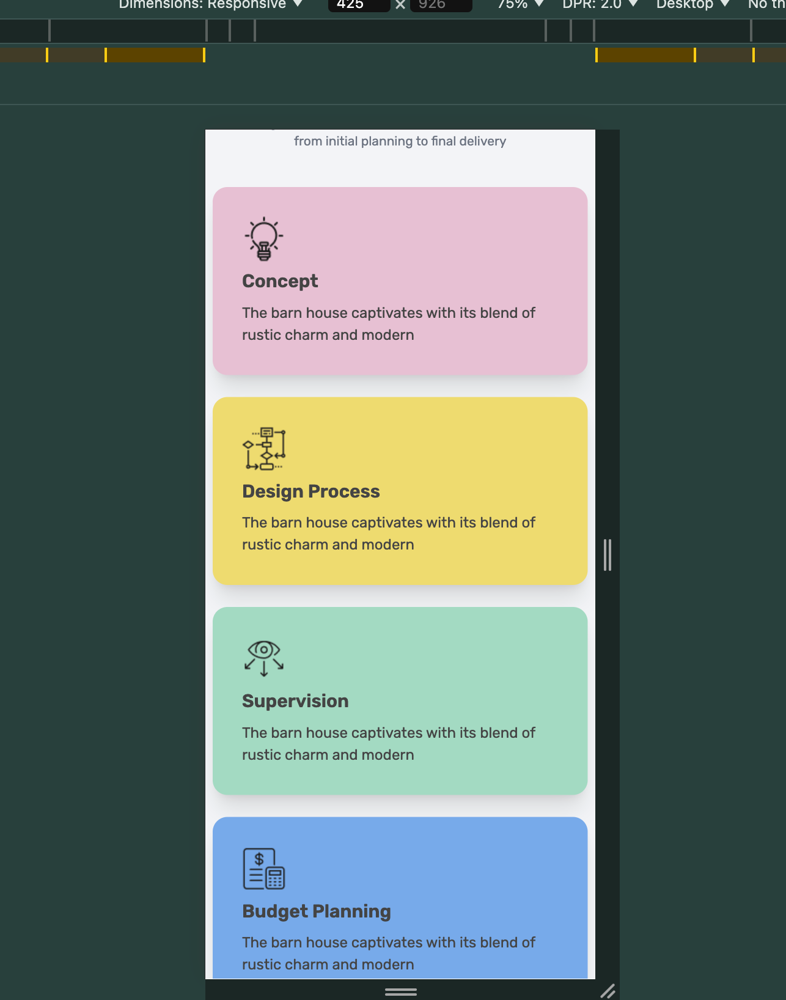
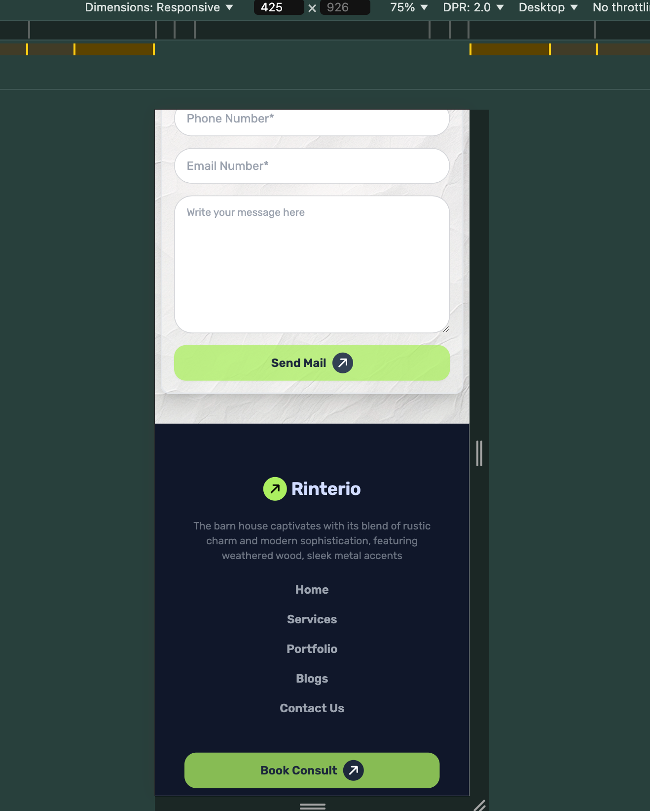

  

## 𝗧𝗵𝗶𝘀 𝝖𝘀𝘀𝗶𝗴𝗻𝗺𝗲𝗻𝘁 𝗶𝘀 𝗯𝗮𝘀𝗲𝗱 𝝾𝗻 𝘁𝗵𝗲 𝝦𝗿𝝾𝗴𝗿𝗮𝗺𝗺𝗶𝗻𝗴 𝗛𝗲𝗿𝝾 𝗰𝝾𝞄𝗿𝘀𝗲. 𝝪𝝾𝞄 𝘀𝗵𝝾𝞄𝗹𝗱 𝗰𝗵𝗲𝗰𝗸 𝘁𝗵𝗲𝗶𝗿 𝗰𝝾𝞄𝗿𝘀𝗲. 𝝖𝗹𝗹 𝘁𝗵𝗲 𝗰𝗿𝗲𝗱𝗶𝘁𝘀 𝗴𝝾 𝘁𝝾 𝘁𝗵𝗲 [𝝦𝗿𝝾𝗴𝗿𝗮𝗺𝗺𝗶𝗻𝗴 𝗛𝗲𝗿𝝾](https://www.programming-hero.com/)

## Rinterio---𝗥𝗘𝗦𝗣𝟬𝝢𝗦𝗜𝗩𝗘-𝗪𝗘𝗕𝗦𝗜𝗧𝗘

✅[𝗩𝗶𝗲𝞈 𝗱𝗲𝗺𝝾](https://ph0enix46.github.io/Assignment--3/) 
<br/>
🐛[𝗕𝞄𝗴 𝗿𝗲𝗽𝝾𝗿𝘁](https://github.com/pH0enix46/Assignment--3/issues)

## 𝗦𝗰𝗿𝗲𝗲𝗻𝘀𝗵𝝾𝘁𝘀












✅𝗘𝗻ᒍ𝝾𝝲! 𝗳𝝾𝗿 𝗹𝗲𝗮𝗿𝗻𝗶𝗻𝗴
<br/>
❌𝗕𝞄𝘁 𝗱𝝾𝗻'𝘁 𝗰𝝾𝗽𝝲 𝗺𝗶𝗻𝗲

## 𝝖𝗰𝗸𝗻𝝾𝞈𝗹𝗲𝗱𝗴𝗺𝗲𝗻𝘁𝘀
[𝝦𝗿𝝾𝗴𝗿𝗮𝗺𝗺𝗶𝗻𝗴 𝗛𝗲𝗿𝝾](https://web.programming-hero.com/home)

```
𝗛𝗮𝝼𝗲 𝗮 𝗻𝗶𝗰𝗲 𝗗𝗮𝝲!😸
```
